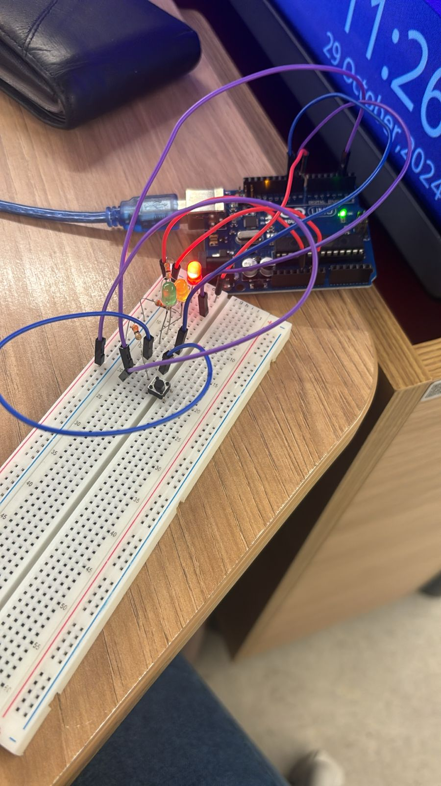

# Projeto: Semáforo com Arduino

## Parte 1: Montagem Física do Semáforo

### Descrição da Montagem
Para a montagem física, utilizei uma protoboard, três LEDs (vermelho, amarelo e verde), três resistores de 330Ω (código de cores: laranja, laranja e marrom) para proteger os LEDs, e um botão para controlar o início do ciclo do semáforo. O Arduino controla as cores do semáforo, alternando as luzes conforme o código fornecido, e o botão permite iniciar o ciclo.

### Passos de Montagem
1. **Protoboard e Conexões dos LEDs**:
   - Coloquei os LEDs (vermelho, amarelo e verde) na protoboard em linhas separadas.
   - A perna longa (anodo) de cada LED foi conectada a uma porta digital do Arduino (8, 9 e 10, respectivamente).
   - A perna curta (catodo) de cada LED foi conectada ao GND, passando por um resistor de 330Ω.

2. **Conexão do Botão**:
   - Adicionei um botão na protoboard, conectado a uma porta digital do Arduino (porta 2) para controlar o ciclo do semáforo.
   - Um lado do botão foi conectado à porta 2 do Arduino, enquanto o outro foi conectado ao GND. A programação foi ajustada para que o ciclo do semáforo inicie ao pressionar o botão.

3. **Conexões dos Resistores**:
   - Utilizei um resistor de 330Ω para cada LED (código de cores: laranja, laranja e marrom) para limitar a corrente e proteger os LEDs.

4. **Organização dos Fios**:
   - Conectei as saídas digitais do Arduino aos LEDs usando fios jumper, mantendo-os organizados e curtos para clareza na visualização da montagem.

### Especificações dos Componentes

| Componente | Especificação               | Quantidade |
|------------|-----------------------------|------------|
| LED        | Vermelho, 5mm               | 1          |
| LED        | Amarelo, 5mm                | 1          |
| LED        | Verde, 5mm                  | 1          |
| Resistor   | 330Ω (laranja, laranja, marrom) | 3      |
| Protoboard | Padrão                      | 1          |
| Jumper     | Cabos para conexão          | Vários     |
| Arduino    | Modelo Uno                  | 1          |
| Botão      | Push button                 | 1          |

---

## Parte 2: Programação e Lógica do Semáforo

### Código

O código para a programação do semáforo foi escrito conforme as instruções, com as seguintes fases e tempos:

- **Vermelho**: 6 segundos
- **Amarelo**: 2 segundos
- **Verde**: 4 segundos (com um intervalo adicional de 2 segundos, totalizando 6 segundos de travessia)
- **Amarelo**: 2 segundos

Aqui está o código:

```cpp
int vermelho = 8; // Define a porta digital para o LED vermelho
int amarelo = 9;  // Define a porta digital para o LED amarelo
int verde = 10;   // Define a porta digital para o LED verde
int botao = 2;    // Define a porta digital para o botão

bool semaforoLigado = false; // Controla o estado do semáforo

void setup() {
  pinMode(vermelho, OUTPUT);
  pinMode(amarelo, OUTPUT);
  pinMode(verde, OUTPUT);
  pinMode(botao, INPUT);
}

void loop() {
  // Verifica se o botão foi pressionado para iniciar o ciclo
  if (digitalRead(botao) == HIGH && !semaforoLigado) {
    semaforoLigado = true;
    delay(50); // Debounce para evitar múltiplas leituras
  }

  if (semaforoLigado) {
    // Fase Vermelha
    digitalWrite(vermelho, HIGH);
    digitalWrite(amarelo, LOW);
    digitalWrite(verde, LOW);
    delay(6000);

    // Fase Amarela
    digitalWrite(vermelho, LOW);
    digitalWrite(amarelo, HIGH);
    digitalWrite(verde, LOW);
    delay(2000);

    // Fase Verde com tempo adicional
    digitalWrite(vermelho, LOW);
    digitalWrite(amarelo, LOW);
    digitalWrite(verde, HIGH);
    delay(4000);

    // Tempo adicional para pedestres
    delay(2000);

    // Fase Amarela antes de retornar ao Vermelho
    digitalWrite(vermelho, LOW);
    digitalWrite(amarelo, HIGH);
    digitalWrite(verde, LOW);
    delay(2000);
  } else {
    // LEDs desligados quando o semáforo não está ativo
    digitalWrite(vermelho, LOW);
    digitalWrite(amarelo, LOW);
    digitalWrite(verde, LOW);
  }
}


## Parte 2: Programação e Lógica do Semáforo

### Código

&nbsp;&nbsp;&nbsp;&nbsp;O código para a programação do semáforo foi escrito conforme as instruções, com as seguintes fases e tempos:

- **Vermelho**: 6 segundos
- **Amarelo**: 2 segundos
- **Verde**: 4 segundos (com um intervalo adicional de 2 segundos, totalizando 6 segundos de travessia)
- **Amarelo**: 2 segundos

Aqui está o código:

```cpp
int vermelho = 8; // Define a porta digital para o LED vermelho
int amarelo = 9;  // Define a porta digital para o LED amarelo
int verde = 10;   // Define a porta digital para o LED verde

void setup() {
  // Configura as portas como saídas para controlar os LEDs
  pinMode(vermelho, OUTPUT);
  pinMode(amarelo, OUTPUT);
  pinMode(verde, OUTPUT);
}

void loop() {
  // Fase Vermelha: liga o LED vermelho por 6 segundos e desliga os outros LEDs
  digitalWrite(vermelho, HIGH);  // Liga o LED vermelho
  digitalWrite(amarelo, LOW);    // Desliga o LED amarelo
  digitalWrite(verde, LOW);      // Desliga o LED verde
  delay(6000);                   // Aguarda 6 segundos

  // Fase Amarela: liga o LED amarelo por 2 segundos
  digitalWrite(vermelho, LOW);   // Desliga o LED vermelho
  digitalWrite(amarelo, HIGH);   // Liga o LED amarelo
  digitalWrite(verde, LOW);      // Desliga o LED verde
  delay(2000);                   // Aguarda 2 segundos

  // Fase Verde: liga o LED verde por 4 segundos
  digitalWrite(vermelho, LOW);   // Desliga o LED vermelho
  digitalWrite(amarelo, LOW);    // Desliga o LED amarelo
  digitalWrite(verde, HIGH);     // Liga o LED verde
  delay(4000);                   // Aguarda 4 segundos

  // Tempo adicional para pedestres: mantém o LED verde ligado por mais 2 segundos
  delay(2000);                   // Aguarda 2 segundos adicionais com o LED verde ligado

  // Fase Amarela antes de retornar ao Vermelho: liga o LED amarelo por 2 segundos
  digitalWrite(vermelho, LOW);   // Desliga o LED vermelho
  digitalWrite(amarelo, HIGH);   // Liga o LED amarelo
  digitalWrite(verde, LOW);      // Desliga o LED verde
  delay(2000);                   // Aguarda 2 segundos antes de reiniciar o ciclo
}

```
## Teste e Resultados
&nbsp;&nbsp;&nbsp;&nbsp;Testei o código para garantir que as fases e os tempos estão funcionando conforme o esperado. O ciclo de troca das cores segue exatamente os tempos estipulados, e as transições entre as luzes ocorrem de forma suave e precisa.


<div align="center">
<sub>Figura 1 - Imagem do sistema </sub>
<br>

<br>
<sup>Fonte: Material produzido pelos autor (2024)</sup>
</div>

&nbsp;&nbsp;&nbsp;&nbsp; Segue abaixo o link do video do  funcionamento do sistema:
https://youtube.com/shorts/_OBahUNVAlo

## Teste e Resultados
&nbsp;&nbsp;&nbsp;&nbsp;Testei o código para garantir que as fases e os tempos estão funcionando conforme o esperado. O ciclo de troca das cores segue exatamente os tempos estipulados, e as transições entre as luzes ocorrem de forma suave e precisa


## Relato da Experiência
&nbsp;&nbsp;&nbsp;&nbsp;Durante o projeto, a montagem física foi concluída de forma tranquila, com as conexões seguindo o esquema convencional de semáforos. O principal desafio foi garantir que o tempo de cada fase estivesse correto, exigindo testes e ajustes finos no código. A avaliação de pares foi uma etapa enriquecedora, proporcionando feedback para melhorias e garantindo que o semáforo funcionasse com precisão.